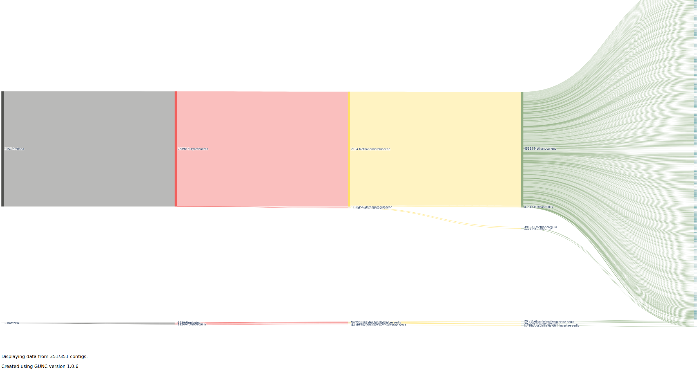

ssh -X sunam235@caucluster.rz.uni-kiel.de
1. basic linux
2. linux commands
3. Bioinformatics basic understanding
   
   - copy from one folder to another:
  
  block of code:
  ```sh
  cp source destination
  ```

  inline code:
  this is the command `cp`
  gunc plot -d /PATH/TO/YOUR/diamond_output/METABAT__#-contigs.diamond.progenomes_2.1.out -g /PATH/TO/YOUR/genes_calls/gene_counts.json
#!/bin/bash
#SBATCH --nodes=1
#SBATCH --cpus-per-task=4
#SBATCH --mem=10G
#SBATCH --time=5:00:00
#SBATCH --job-name=fastqc
#SBATCH --output=fastqc.out
#SBATCH --error=fastqc.err
#SBATCH --partition=base
#SBATCH --reservation=biol217
is a command line for executing a process
#SAMPLENAME.SAM SAVES YOUR OUTPUT IN THE EXACT SAME FOLDER.

module load gcc12-env/12.1.0
module load miniconda3/4.12.0
conda activate anvio-8
 activates the conda environment

 >>txt.file    

cd /work_beegfs/sunam235/Metagenomics/assembly
scp sunam235@caucluster.rz.uni-kiel.de:/work_beegfs/sunam235/Metagenomics/3_coassembly/*.fastg
coping to the desktop from a local terminal

So... from raw reads......

#Quality control
1.fastqc
##command fastqc file.gz -o output_folder/
1.1 in a aloop
##command for i in *.gz; do fastqc $i -o output_folder/; done
2.fastp
##command fastp -i ? -I ? -R ? -o ? -O ? -t 6 -q 20

reformat the fastp out put to a format that is compatible with the anvio
mapping is done with the contigs(results of the megahit) and the clean reads(results of the fastp)
fastq and fastp(input were the raw reads from fastq) are quality control methods done before the assembly of the contigs, then do megahit (sstiches the short reads together to from contigs) to assemble your contigs in fasta file formats (input are the clean reads from fastp)
results of the megahit are a fasta file
can be converted to a fastg file using the ## 
format the contigs in fasta file format to contigs anvio.fa format, before runnng the index. 

#Mapping
once your contigs.anvio.index is generated, now run the mapping commad ##module load bowtie2
bowtie2 --very-fast -x contigs.anvio.fa.index -1 /PATH/TO/sample1_R1_clean.fastq.gz -2 /PATH/TO/sample1_R2_clean.fastq.gz -S SAMPLE.
this overlays the indexes and the clean reads inorder to map.

the output from mapping (sam files) are converted into BAM files for further processing using the command ##module load samtools
samtools view -bs sam_file.sam > bam_file.bam

#contigs data preparation
using the ##command anvi-gen-contigs-database -f contigs.anvio.fa -o contigs.db -n 'biol217'
helps you compute:
1.kmer frequencies
2.soft split contigs longer than 20kbp into smaller ones
3.identify ORFs using prodigal,(searxches for functinal genes in bacteria and archea)

#HMM search on contigs
this is the hidden markov model
searches for specific genes with a known function in a larger dataset
uses the command ##anvi-run-hmms -c contigs.db
it identifies hits (bacterial single copy core gene collections) among your genes to the collections.

#Visualisation of contigs
using the command anvi-display-contigs-stats contigs.db using the ##command srun --reservation=biol217 --pty --mem=10G --nodes=1 --tasks-per-node=1 --cpus-per-task=1 --nodelist=node010 /bin/bash
this is done on the terminal to give us access to the NODES in order to visualise the contigs.db (with which we run our hmms) 
this is possible when you have:
1.your contigs
2. and your HMMs are run

#Binning with ANVI'o
1. sorting and idexing bam files
##command *.bam; do anvi-init-bam $i -o ''$i''.sorted.bam;done
before proceding to genome binning(grouping contigs and assigning them to individual genomes) a few preparation steps are required. 
That is;
2. creating an anvio profile
this profile stores sample specific information about the contigs
therefore gives  properties for each contig in a single sample based on mapping results.
##comand anvi-profile -i ? -c ? --output-dir ?
i-sorted and indexed bam file
c-contig database file
3.Profile merging.
merge the profiles into one (that is the 3 profiles you have for your 3 samples must be merged into 1 whole anvio profile)
this is done by overlapping all the profiles alongside the contigs database
4.Binning
different tools can be used:
1.1 Metabat2
1.2 binsanity
1.3 MaxBin2
#Using metabat2
to cluster the merged profiles against the contigs database
using the ##command anvi-cluster-contigs -p ? -c ? -C METABAT --driver metabat2 --just-do-it --log-file log-metabat2
1. Resuts:
3 archea bins (97.37%, 59.96% & 43.65%)

anvi-summarize -p /PATH/TO/merged_profiles/? -c ? -o SUMMARY_METABAT -C ?

#Using MaxBin2
using the ##command anvi-cluster-contigs -p ? -c ? -C MAXBIN2 --driver maxbin2 --just-do-it --log-file log-maxbin2

anvi-summarize -p /PATH/TO/merged_profiles/? -c ? -o SUMMARY_MAXBIN2 -C ?
helps creat a folder of the results for each binning tool that has been run
BINSANITY (150 bins, representing 57721 items).
* METABAT (48 bins, representing 8961 items).
MAXBIN2 ()


## 4.2 CheckM
micromamba activate 04_checkm_quast
cd $WORK/genomics/3_hybrid_assembly
mkdir -p $WORK/genomics/3_hybrid_assembly/checkm
checkm lineage_wf $WORK/genomics/3_hybrid_assembly/ $WORK/genomics/3_hybrid_assembly/checkm -x fasta --tab_table --file $WORK/genomics/3_hybrid_assembly/checkm/checkm_results -r -t 32
checkm tree_qa $WORK/genomics/3_hybrid_assembly/checkm
1.multiple binners
2.reassembling them with the clean reads
3.chimera (different contigs binned together)detection using the GUNC tool

then...
#QC run on the bins(MAGs) again

#reassemble 

then...
#run a chimera detection
tool used can be GUNC

#summary of your collections
anvi-summarize -p /PATH/TO/merged_profiles/PROFILE.db -c /PATH/TO/contigs.db --list-collections

#chimera detection
create a folder and place all the archea binns from the metabat run (grouping the bins )
activate the gunc environment
then run the ##command for i in *.fa; do gunc run -i ? -r /work_beegfs/sunam###/Databases/gunc_db_progenomes2.1.dmnd --out_dir ? --threads 10 --detailed_output; done

gunc plot -d /PATH/TO/YOUR/diamond_output/METABAT__#-contigs.diamond.progenomes_2.1.out -g /PATH/TO/YOUR/genes_calls/gene_counts.json
uses a GUNC tool that assigns the bins scores between 0 to 1 and thet are with in a CSC and RSS format
this is done using the #command gunc plot -d /PATH/TO/YOUR/diamond_output/METABAT__#-contigs.diamond.progenomes_2.1.out -g /PATH/TO/YOUR/genes_calls/gene_counts.json
it plots the CSC and RSS. The closer the value is to 0, the better or more refined our bind are

Day 6
Genomics 
#steps done
Short reads-QC
fastqc tool-quality 
fastp tool- quality and trimming
fastqc tool-quality check again

long reads-QC
Nanoplot tool -quality
filtlong tool-quality and trimming
Nanoplot tool-quality again

hybrid assembly
using Unicycler tool (can clean the reads too if not cleaned prior)
assembles the clean Short reads and clean long reads

assembly QC
Using:
CheckM & checkM2 & Quast tools
determined based on :
completeness
level of contamination

assembly annotation
using PROKKA tool


Day 7
#Pan genomics and phylogenomics
shows relationship between related organisms
dendogram is drawn to shwo the relationship
*a Pan genome basically the results from the comparison of related organisms.
Usually done at a genus (here you will deal with a bigger number of genomes due to the diffeent species) or species level
species level is better

1. relevance
analyses geneome function and functional relationships
ANI can be computred and visualised

2. information a pan genome entails
multiple related genomes (singletons, accessory and core genes) and MAGs
number of genes, gene cluster and orthologues (cluster: a group of genes with similar sequences)
single copy genes-one copy is (anvio-8) [sunam228@caucluster1 V_jascida_genomes]$ anvi-script-gen-genomes-file --input-dir /path/to/input/dir \
n micromamba
*depicted as a dendogram or rings to organise the pan genome
2. Gene frequency analysis 
analysises the frequency of; core, accessory and singleton genes

#Phylogeomics and taxonomy
phylogenomics: uses a large number large of genes/ proteins
phylogenetics: uses individual/ small number of genes
phylogenomics: shows the relationship between the different genomes
1.Taxonomic identification
can be done based on;
phylogenomics
sequencing data of partial or complete genomes
Protein-based; that is Relative Evolutinary abundance
ANI

##Phylogenomic application
ANI used for analysis of whole genome similarity(used for species identification)
compares your sequence to other sequences in a database
*Databases
TYGS-Type strain database (strain that was isolated and identified first)
JSpeciesWs
* the best databases to use are the most updated  
1. for phylogenomic conparison, the sequnce must have:
 the whole genome similarity ANI, of atleast 95%
 completeness of atleast 98%
 should have SCGs

 #pangenomics
 1.downloaded 52 genomes (as fasta files) of Vibrio jasicida strains using Anvio
2.created contig databases for sample
3.visualised the contigs using ##command
 block of code:
'''sh 
module load gcc12-env/12.1.0
module load miniconda3/4.12.0
conda activate anvio-8
anvi-display-contigs-stats /path/to.your/databases/*db
'''

4.created external genomes
this was done using the  contigs databases for ecah sample created.
this combines tzhe details on how to access the contigs databases when running ANVIO
##command anvi-script-gen-genomes-file --input-dir /path/to/input/dir \
                             -o external-genomes.txt
the input here are the contigs databases generated.
5.investigation of contamination
done in the terminal
done by estimating contamination
##command cd V_jascida_genomes
anvi-estimate-genome-completeness -e external-genomes.txt

(anvio-8) [sunam235@caucluster1 downloads]$ anvi-estimate-genome-completeness -e external-genomes.txt
+----------------------------------------------------------------------------+----------+--------------+----------------+----------------+--------------+----------------+
| genome name                                                                | domain   |   confidence |   % completion |   % redundancy |   num_splits |   total length |
+============================================================================+==========+==============+================+================+==============+================+
| my_genome_Acinetobacter_pittii_PHEA-2                                      | BACTERIA |            1 |            100 |              0 |          193 |        3862530 |
+----------------------------------------------------------------------------+----------+--------------+----------------+----------------+--------------+----------------+
| my_genome_Bacillus-smithii-strain_DSM_4216                                 | BACTERIA |            1 |            100 |              0 |          168 |        3368778 |
+----------------------------------------------------------------------------+----------+--------------+----------------+----------------+--------------+----------------+
| my_genome_Bacillus_subtilis_subsp._subtilis_str._168                       | BACTERIA |            1 |            100 |              0 |          209 |        4215606 |
+----------------------------------------------------------------------------+----------+--------------+----------------+----------------+--------------+----------------+
| my_genome_Mycobacterium_tuberculosis_H37Rv                                 | BACTERIA |            1 |          98.59 |           1.41 |          220 |        4411532 |
+----------------------------------------------------------------------------+----------+--------------+----------------+----------------+--------------+----------------+
| my_genome_Pseudomonas_aeruginosa_strain_NCTC10332                          | BACTERIA |            1 |          97.18 |           1.41 |          315 |        6316979 |
+----------------------------------------------------------------------------+----------+--------------+----------------+----------------+--------------+----------------+
| my_genome_Salmonella_enterica_subsp._enterica_serovar_Typhimurium_str._LT2 | BACTERIA |            1 |          98.59 |              0 |          242 |        4857450 |
+----------------------------------------------------------------------------+----------+--------------+----------------+----------------+--------------+----------------+
| my_genome_Staphylococcus_aureus_subsp._aureus_NCTC_8325                    | BACTERIA |            1 |            100 |           2.82 |          141 |        2821361 |
+----------------------------------------------------------------------------+----------+--------------+----------------+----------------+--------------+----------------+
| my_genome_Staphylococcus_epidermidis-strain-ATCC_14990                     | BACTERIA |            1 |            100 |           1.41 |          123 |        2466502 |
+----------------------------------------------------------------------------+----------+--------------+----------------+----------------+--------------+----------------+

6.visual
in anvi interactive
##command anvi-interactive -c V_jascida_52.db \
                 -p V_jascida_52/PROFILE.db
7. now we split the bins
first, save the bins you wants to keep from the anvio display(go to bins, give it a name and save as default)
to split use the ##command anvi-split -p V_jascida_52/PROFILE.db \
           -c V_jascida_52.db \
           -C default \
           -o V_jascida_52_SPLIT

# Here are the files you created
#V_jascida_52_SPLIT/V_jascida_52_CLEAN/CONTIGS.db

8 split Vs unsplit estimation
using the estimation command
##command anvi-estimate-genome-completeness -e external-genomes.txt
anvi-estimate-genome-completeness -e external-genomes-final.txt
9. compute the pangenome
i.e the common sequence among the related genomes
##command anvi-gen-genomes-storage -e external-genomes-final.txt \
                         -o V_jascida-GENOMES.db

anvi-pan-genome -g V_jascida-GENOMES.db \
                --project-name V_jascida \
                --num-threads 4 
10.visualisation of the pangenome
using the srun command.
##command srun --pty --mem=10G --nodes=1 --tasks-per-node=1 --cpus-per-task=1 --partition=base /bin/bash

module load gcc12-env/12.1.0
module load miniconda3/4.12.0
conda activate anvio-8_biol217

anvi-display-pan -p V_jascida/V_jascida-PAN.db \
                 -g V_jascida-GENOMES.db
In a new terminal (update the node "n100" to actually used one)

ssh -L 8060:localhost:8080 sunam226@caucluster.rz.uni-kiel.de

ssh -L 8080:localhost:8080 n100

11.computing phylogenomics for the pangenome
anvi-compute-genome-similarity -e external-genomes.txt \
                 -o ANI \
                 -p PROCHLORO/Prochlorococcus_Pan-PAN.db \
                 -T 12

anvi-get-sequences-for-gene-clusters -p PROCHLORO/Prochlorococcus_Pan-PAN.db \
                                     -g PROCHLORO-GENOMES.db \
                                     --min-num-genomes-gene-cluster-occurs 31 \
                                     --max-num-genes-from-each-genome 1 \
                                     --concatenate-gene-clusters \
                                     --output-file PROCHLORO/Prochlorococcus-SCGs.fa

trimal -in PROCHLORO/Prochlorococcus-SCGs.fa \
       -out PROCHLORO/Prochlorococcus-SCGs-trimmed.fa \
       -gt 0.5 

iqtree -s PROCHLORO/Prochlorococcus-SCGs-trimmed.fa \
       -m WAG \
       -bb 1000 \
       -nt 8

echo -e "item_name\tdata_type\tdata_value" \
        > PROCHLORO/Prochlorococcus-phylogenomic-layer-order.txt

# add the newick tree as an order
echo -e "SCGs_Bayesian_Tree\tnewick\t`cat PROCHLORO/Prochlorococcus-SCGs-trimmed.fa.treefile`" \
        >> PROCHLORO/Prochlorococcus-phylogenomic-layer-order.txt

# import the layers order file
anvi-import-misc-data -p PROCHLORO/Prochlorococcus_Pan-PAN.db \
                      -t layer_orders PROCHLORO/Prochlorococcus-phylogenomic-layer-order.txt
Visusalisation 
anvi-display-pan -g PROCHLORO-GENOMES.db \
                 -p PROCHLORO/Prochlorococcus_Pan-PAN.db
Day 8
Transcriptomics
has formats;
RNA-seq
Ribo-Seq
when using ribo seq , you need both RNA-seq& Ribo-Seq and then get the translation efficiency
that is;the ratio of Ribo-Seq levels to RNA-seq levels
1.step in RNA Seq
study design
library preparation
analysis
1.1 study design
ensure that,
have a cvontrol
observable changes
phenotypic differences
you know what the control is based on
1.2 obtaining data for RNAseq
Find the accession number of the data you want to download, mentioned in the published paper.
Go to the NCBI website and search for the accession number.
Download the data from SRA database.
Find the SRR numbers of the data you want to download. and run the following commands:

image insertion in markdown




day 9
#Ribosome profiling
translation efficiency
visualisation of expression in IGB

#R & R studio
